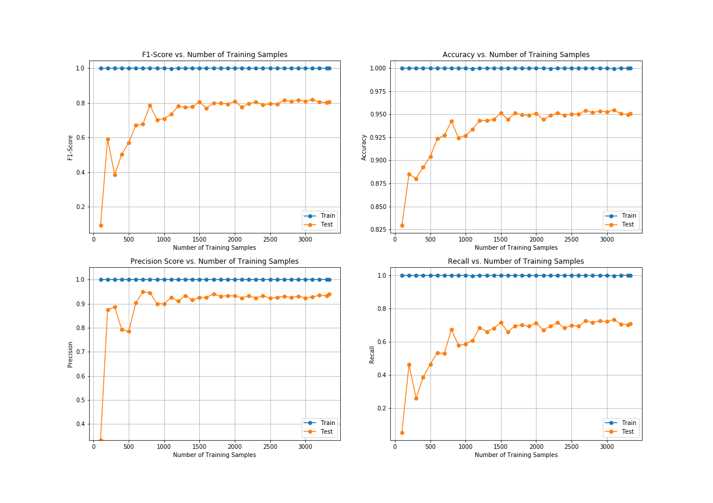

# Machine Learning Tool

The focus of this tool is to make the machine learning model building and validation workflow very fast and easy. 

This is done by abstracting away all the cross validation and plotting functionality with a reusable class. 

This class also allows us to train and score these models in parallel. 

It also has built in learning curve plotting functionality to assess model perforamnce's.  

As a case study, we use a Cellular Service Provider data set were we are tasked with building a model that can identify users 
who are predicted to churn. Naturally in subscription based services, these data sets are unbalanced since most users 
don't cancel their subscription on any given month. 

Let's see how this tool can help us achieve our goal!

Check out the [Jupyter Notebook](https://github.com/DataBeast03/DataBeast/blob/master/ML_Tool/ML_Tool.ipynb)

```python

# create model
rfc = RandomForestClassifier(n_estimators=100, 
                             criterion='entropy', 
                             n_jobs=-1)
# initialize ml tool 
cv_rfc = cross_validation(rfc, 
                      X_churn, 
                      Y_churn, 
                      average='binary',
                      init_chunk_size=100, 
                      chunk_spacings=100,
                      n_splits=3)

# call method for model training
cv_rfc.train_for_learning_curve()

# call method for ploting model results
cv_rfc.plot_learning_curve(image_name="Learning_Curve_Plot_RF", save_image=True)

```



